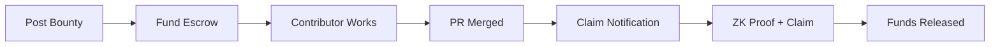

# BounTEA - The Bounty System for Open Source Development

**Post cryptocurrency bounties on GitHub issues, fund them on TEA Network, and contributors claim rewards using GPG-based Account Abstraction.**

BounTEA integrates cryptocurrency bounties directly into the GitHub workflow, leveraging the unique capabilities of the TEA Network and its GPG Precompile for seamless rewards distribution.

## ✨ Key Features

- **Simple Bounty Creation**: Post bounties with a single comment: `/bountea post <amount> <TOKEN>`
- **GPG-Based Claims**: Contributors use their existing GPG keys - no wallet setup required
- **Smart Contract Escrow**: Secure fund holding on TEA Network until legitimate claims
- **Zero-Knowledge Proofs**: Secure claim verification without revealing private keys
- **Automated Workflow**: Seamless integration with GitHub PR merge process

## 🚀 Quick Start

### For Repository Owners

1. **Install BounTEA GitHub App**
   ```
   Visit: https://github.com/apps/bounteas/installations/new/
   Select repositories to enable bounties
   ```

2. **Post a Bounty**
   ```
   Comment on any GitHub issue:
   /bountea post 100 TEA "Fix the critical bug in authentication module"
   ```

3. **Fund the Bounty**
   ```
   Send tokens to the BounTEA Escrow contract address provided
   Bounty becomes active once funding is confirmed
   ```

### For Contributors

1. **Find Bountied Issues**
   - Look for issues with funded BounTEA bounties
   - Check bounty amount and requirements

2. **Contribute with GPG-Signed Commits**
   ```bash
   # Ensure your commits are GPG signed
   git commit -S -m "Fix authentication bug"
   
   # Link PR to issue
   # In PR description: "Fixes #123"
   ```

3. **Claim Your Bounty** (after PR merge)
   ```bash
   # Use ZK Pass tool to generate proof
   zkpass generate --gpg-key <your-gpg-id> --commit <commit-hash>
   
   # Use GPG Wallet to claim bounty
   gpg-wallet claim-bounty --bounty-id <id> --proof <zk-proof>
   ```

## 🔧 How It Works

### 1. Bounty Lifecycle



### 2. Technical Architecture

**TEA Network Integration:**
- **GPG Precompile**: Validates GPG signatures and manages Account Abstraction
- **Smart Contract Escrow**: Holds funds securely until legitimate claims
- **Token Allowlist**: Centrally managed list of approved tokens

**Security Layers:**
- **GPG Signature Verification**: Cryptographic proof of code authorship
- **Zero-Knowledge Proofs**: Prove GPG ownership without exposing private keys
- **Smart Contract Validation**: On-chain verification of claims

### 3. Example Workflow

```typescript
// 1. Repository owner posts bounty
// Comment: /bountea post 500 TEA "Implement OAuth integration"

// 2. BounTEA responds with funding instructions
// Amount: 500 TEA
// Escrow: 0x742d35Cc6637C0532c2e...
// Bounty ID: #2024-001

// 3. Contributor submits GPG-signed PR
git commit -S -m "feat: implement OAuth integration

Fixes #42"

// 4. After merge, contributor claims with ZK proof
claimBounty(
  bountyId: "2024-001",
  commitHash: "abc123...",
  zkProofData: "proof_generated_by_zkpass_tool"
)
```

## 🛠 Requirements

### For Contributors
- **GPG Key**: Configured for signing commits
- **ZK Pass Tool**: For generating zero-knowledge proofs
- **GPG Wallet**: For interacting with TEA Network

### For Repository Owners
- **GitHub Repository**: With BounTEA app installed
- **TEA Network Wallet**: For funding bounties
- **Approved Tokens**: From the TEA Network allowlist

## 📋 Supported Tokens

BounTEA uses a curated allowlist of tokens on TEA Network:
- **TEA** - Native network token
- **USDC** - Stablecoin for consistent bounty values
- **WETH** - Wrapped Ethereum
- *Additional tokens managed by TEA team*

## 🔒 Security Features

- **Multi-layered Verification**: GPG signatures + ZK proofs + smart contract validation
- **Account Abstraction**: GPG keys become crypto wallets through TEA Network precompile
- **Escrow Protection**: Funds locked until legitimate claims verified
- **Audit Trail**: All transactions recorded on TEA Network blockchain

## 💰 Cost Structure

- **Platform Fees**: None - BounTEA is completely free to use
- **Network Fees**: Only standard TEA Network gas costs
  - Funding bounties: ~$0.01-0.05
  - Claiming bounties: ~$0.01-0.05
  - Fund transfers: ~$0.01-0.05

## 🚦 Getting Started

### Prerequisites

1. **Install GPG** (if not already installed)
   ```bash
   # macOS
   brew install gnupg
   
   # Ubuntu/Debian
   sudo apt install gnupg
   ```

2. **Configure Git GPG Signing**
   ```bash
   git config --global user.signingkey <your-gpg-key-id>
   git config --global commit.gpgsign true
   ```

3. **Install BounTEA Tools**
   - [ZK Pass Tool](https://github.com/tea-xyz/zkpass-tool)
   - [GPG Wallet](https://github.com/tea-xyz/gpg-wallet)

### First Bounty

1. **Repository Owner**: Install BounTEA app on your repo
2. **Post Bounty**: Comment `/bountea post 100 TEA` on an issue  
3. **Fund Bounty**: Send 100 TEA to provided escrow address
4. **Contributors**: Submit GPG-signed PRs linked to the issue
5. **Claim Rewards**: Use ZK Pass + GPG Wallet after PR merge

## 🎯 Use Cases

- **Bug Bounties**: Reward security researchers and bug hunters
- **Feature Development**: Incentivize specific feature implementations  
- **Documentation**: Pay for comprehensive docs and tutorials
- **Code Reviews**: Reward thorough peer reviews
- **Maintenance**: Incentivize ongoing project maintenance

## 🤝 Contributing to BounTEA

This project uses BounTEA to reward contributors! Check out our [issues](https://github.com/sarkazein/bountea-website/issues) for funded bounties.

### Development Setup

```bash
# Clone repository
git clone https://github.com/sarkazein/bountea-website.git
cd bountea-website

# Install dependencies
pnpm install

# Start development server
pnpm dev
```

## 📚 Learn More

- **TEA Network**: [tea.xyz](https://tea.xyz)
- **GPG Signing Guide**: [GitHub Docs](https://docs.github.com/en/authentication/managing-commit-signature-verification)
- **Account Abstraction**: [EIP-4337](https://eips.ethereum.org/EIPS/eip-4337)

## 🆘 Support

- **Documentation**: [Coming Soon]
- **Discord**: [Tea Community](https://discord.gg/tea)
- **Issues**: [GitHub Issues](https://github.com/sarkazein/bountea-website/issues)

## 📄 License

This project is licensed under the GPL-3.0-or-later License - see the [LICENSE](LICENSE) file for details.

---

**Built with ❤️ for the open source community by the TEA team**
